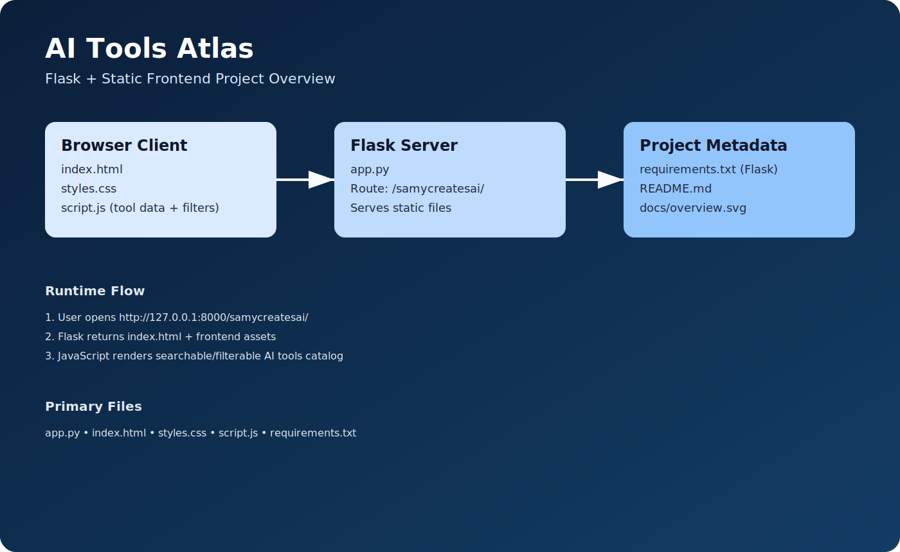

# AI Tools Atlas

AI Tools Atlas is a Flask-powered single-page website that helps users discover and compare popular AI tools across categories such as writing, coding, design, video, productivity, and automation.

## Project Overview

This project serves a static frontend with a lightweight Flask backend.



### What the app does

- Lists AI tools in a clean card-based layout
- Supports search by name, use case, and features
- Provides category and pricing filters
- Shows details like pricing, best-for use cases, core specs, and key features
- Includes outbound links to tool websites and AI directories

## Tech Stack

- Backend: Python + Flask
- Frontend: HTML, CSS, Vanilla JavaScript
- Hosting model: Flask serves static files from the project directory

## Repository Structure

```text
.
├── app.py
├── index.html
├── styles.css
├── script.js
├── requirements.txt
├── .gitignore
├── README.md
└── docs/
    └── overview.svg
```

## Local Run

```bash
python3 -m venv .venv
source .venv/bin/activate
pip install -r requirements.txt
python app.py
```

Open: `http://127.0.0.1:8000/samycreatesai/`

## Notes

- Route base is `/samycreatesai/`.
- For production, run with a proper WSGI server (Gunicorn/uWSGI) behind Nginx.
- Keep virtual env and cache files out of git.

